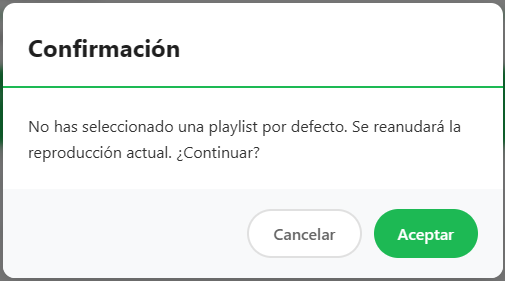
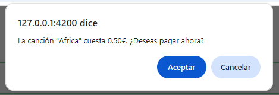

# Tests de la aplicación Gramola de esipotify
## Test 1: Buscar y añadir una canción a la cola de reproducción
- ### Escenario:
    Un cliente intenta pagar una canción con una tarjeta rechazada. Se debe mostrar el mensaje de error adecuado en el frontend y no debe registrarse ninguna transacción en el backend.
- ### Precondiciones:
  * El usuario debe tener una cuenta en la aplicación Gramola con correo {CORREO} y contraseña {CONTRASENA}
  * El usuario debe haber obtenido el {SPOTIFY_TOKEN} en otro navegador antes de ejecutar el test, y debe poner este token en el código del test para que se almacene en sessionStorage.
  * El usuario debe tener activa la reproducción de Spotify en, al menos, uno de sus dispositivos vincualdos a Spotify.
- ### Pasos que realiza el test:
1. Abrir la aplicación Gramola en http://127.0.0.1:4200
2. Clic en "Iniciar sesión"
3. Escribir la dirección de correo electrónico {CORREO}
4. Clic en el campo de contraseña
5. Escribir la contraseña {CONTRASENA}
6. Clic en el botón (`<button>`) "Iniciar sesión"
7. Seleccionar en el slide de precios el valor de 0,50€
8. Clic en el primer dispositivo que aparece, por ejemplo <h6 >Web Player (Chrome)</h6>

9. Clic en el `<button>` "Continuar a la Gramola"
10. Clic en "Aceptar" del `dialogservice.confirm()` para continuar sin seleccionar una playlist por defecto 
11.  Clic en la barra de búsqueda (`<input>` "Buscar canciones, artistas, álbumes...")
12.  Escribir en barra de búsqueda una canción con el nombre completo y exacto de Spotify (p.ej."Africa")
13.  Clic en el `<button>`de "Buscar"
14.  Tomar el primer elemento de los resultados y hacer clic en el `<button>` de "Añadir a la Cola"

15. Intro o clic en "Aceptar" del `dialogservice.confirm()` para proceder al pago de la canción 

16.    Clic en campo de número de tarjeta (`<input>` "Número de la tarjeta de crédito o débito")
17. Escribir 4242 4242 4242 4242 (automáticamente pasa a la fecha de caducidad)
18. Escribir 03/30 y CVV 123
19. Clic en el `<button>` de "Completar pago..."

- ### Assertions:
- **1:** Comprobar desde el frontend que se ha añadido a la cola la canción "Africa". Puede estar en primera posición o no, porque pueden ahberse añadido otras antes. Por ello, se debe buscar en toda la cola.
- **2:** Comprobar desde el backend en la base de datos que se ha registrado la transacción de la compra de la canción, con estado `completed` y que esa transacción corresponde al usuario con el correo autenticado.
- **3:** Comprobar desde el backend en la base de datos que la última canción añadida a la cola de reproducción es del usuario con el correo autenticado.

## Test 2: Fallo en el pago por tarjeta inválida
- ### Escenario:
   Un cliente del bar busca una canción. Paga con una tarjeta inválida y se comprueba que el pago ha fallado y que se muestra el mensaje de error adecuado en el frontend.
- ### Precondiciones:
  * El usuario debe tener una cuenta en la aplicación Gramola con correo {CORREO} y contraseña {CONTRASENA}
   * El usuario debe haber obtenido el {SPOTIFY_TOKEN} en otro navegador antes de ejecutar el test, y debe poner este token en el código del test para que se almacene en sessionStorage.
   * El usuario debe tener activa la reproducción de Spotify en, al menos, uno de sus dispositivos vincualdos a Spotify.
- ### Pasos que realiza el test:
    Mismos pasos del Test 1, cambiando solo los valores de la tarjeta (pasos 18 y 19):
    Se utilizan los siguientes valores para cada resultado esperado:

    | Resultado esperado | Número de tarjeta   | Fecha de caducidad | CVC |
    | ------------------ | ------------------- | ------------------ | --- |
    | Tarjeta rechazada  | 4000 0000 0000 0002 | 03/30              | 123 |
    | Tarjeta inválida   | 1231 2312 3123 2131 | 03/30              | 123 |
    | Tarjeta incompleta | 4242 4242 4242      | 03/30              | 123 |
    | Caducidad pasada   | 4242 4242 4242 4242 | 01/20              | 123 |
    | Caducidad inválida | 4242 4242 4242 4242 | 12/99              | 123 |

- ### Assertions:
  En cada uno de los siguientes tests, se comprueba que el elemento `.card-error-message` contiene el mensaje esperado.

  **testPagoTarjetaRechazada:**
  - Verifica que aparece el mensaje de error: "Tu tarjeta ha sido rechazada."
  
  **testPagoTarjetaInvalida:**
  - Verifica que aparece el mensaje de error: "El número de tu tarjeta no es válido."
  
  **testPagoTarjetaIncompleta:**
  - Verifica que aparece el mensaje de error: "El número de tu tarjeta está incompleto."
  
  **testPagoCaducidadPasada:**
  - Verifica que aparece el mensaje de error: "El año de caducidad de tu tarjeta ya ha pasado."
  
  **testPagoCaducidadInvalida:**
  - Verifica que aparece el mensaje de error: "El año de caducidad de la tarjeta no es válido."
